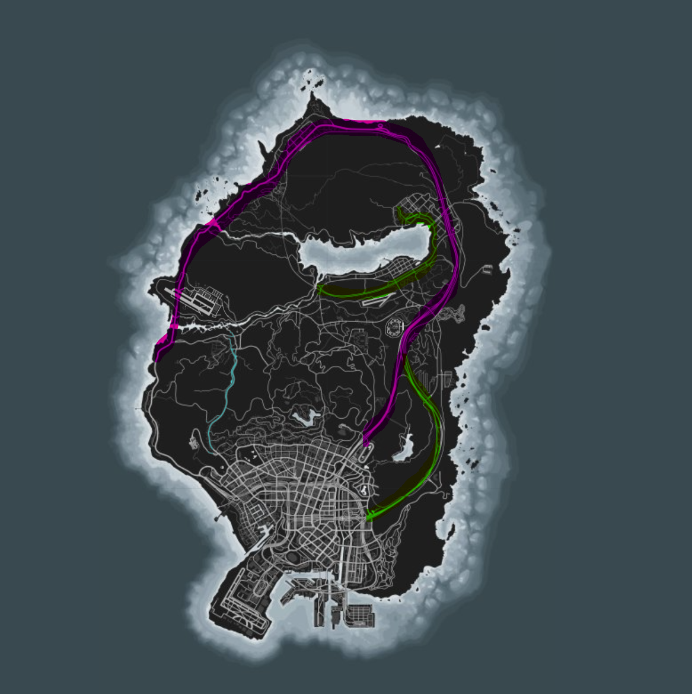

# AutoDrive GTA5
 Autonomous Driving simulation in GTA 5 game

### Requirements

- Your own instance of GTA 5 game
- Your python environment (anaconda preferably) and required libraries for a conda env are listed in `Requirements.txt` file. Link is [here](./Requirements/Requirements.txt)
- a GPU is preferable for training 
- You require installation of Native Trainer Mod in your GTA5. [Here](https://www.gta5-mods.com/tools/script-hook-v) is the link for it. The instructions are present on the website and also included in the download zip file.

### Training scenarios
- Currently, only considered training scenario where there is no traffic.
- Different routes were selected to generate data on these routes repeatedly.
- Below map shows highlighted routes on which data was generated:-
 

- Due to time constraints, we were able to generate just 1.5 GB worth of data. The model requires a huge amount of data to have enough values for `rare` inputs such as `reverse()` or take into consideration `rare cases` such as turns or sharp turns.

### Evaluation

### Comparative Analysis

- This is more qualitative.
- I will be comparing it with SentDex's implementation (update upto video #14).
- Our model is Google's Inception v3 whereas the related work makes use of AlexNet
- There are some qualitative points to be considered when comparing both models:-
    - Inception model is much more complex and is deeper. This complexity helps it capture more complex representations
    - Inception model was performing better than AlexNet and it has the capability to generalise better on the data
- However, the quality of training also depends heavily on fine tuning process for the game as well as the quality of the data that we collect.

### Areas of Improvement
- In continuation to last section
- Based on our evaluation, it seems the more data we have the more better it is. However, the larger data will require taking into consideration modifying the preprocessing part to accomodate for large scale image data.
- Increasing training set size will require more training time. For instance, training nearly 2GB of collected training data on just few route scenarios takes the model 4-5 minutes at minimum per epoch. The model is being trained for 25 epochs in average. So the total (minm) training time is at an estimate of 2 hours. 
- We are performing Minibatch optimization, one way to speedup process is to increase batch size for training part. However, need to take into consideration the GPU memory constraints.

### Workflow / Steps to recreate
- First, ensure that you are playing the gta game in windowed 800x600 resolution. Move the game window to the top left.
- Now open your conda shell, activate your environment with all requirements installed.
- **Collecting data**: for data collection you need to run, `python collect_data.py 0` or `python collect_data.py 1`. At option `1`, the data collection introduces noise/error in real time to the output labels instead of the `no input` label. If `0` is selected then `no input` option is taken into consideration. You can use the above map for reference to generate data in the same scenarios. We also links to our own data collection on google drive. [Here is the link to the folder with the data](https://drive.google.com/drive/folders/1azfugKU4pLni8HcxljjdaoFlpzhjOmu-?usp=sharing). You can find data in `Data` folder as `.npy` files.
    - Note: if you want to pause for a break during data collection, you can toggle the `T` key to pause/unpause.

- `python balance_data.py` file can be run to just take a look at class imbalance stats of the data. The balancing of data had been explicitly disabled. Project report explains the reason in detail

- **Model Training**: For training just run `python train_model.py`. This will take on average a time of 2 hrs on 1.5 GB worth of data. If you want you can explicitly increase the `batch_size` hyperparameter to increase the `time/epoch`. Epochs can be increased too but it will take a huge amount of time (in scale of days).

- **Deployment**: To test our model in deployment. Keep the game window on top left. Run command `python model_test.py`. A countdown will start from 4 for you to recuperate your attention back to the game screen. You can toggle `T` key to pause/unpause the simulation of the inputs in the game.
